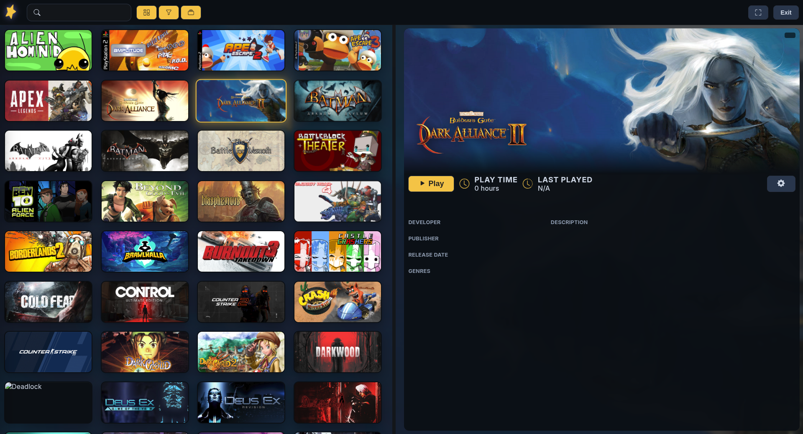
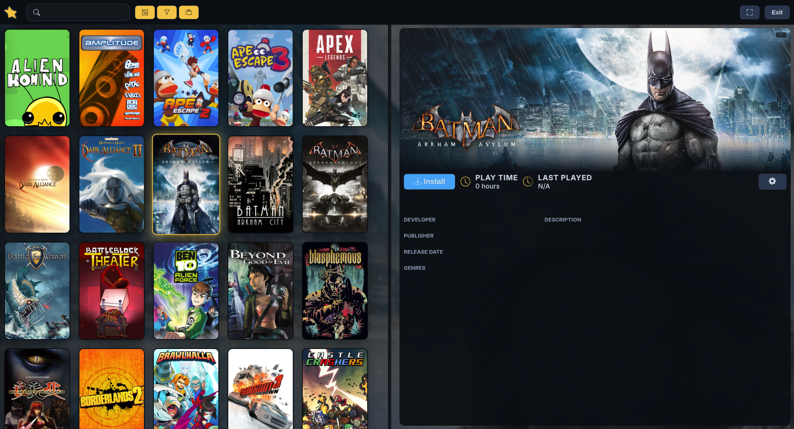
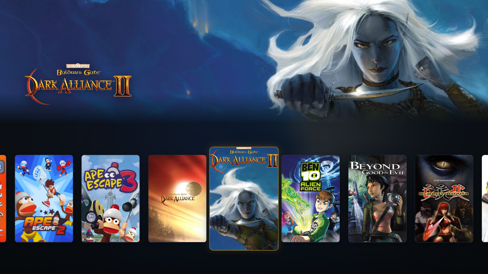

# StellarHub

A Linux game launcher, with Fullscreen mode, built with Electron.js.

---

# Screenshots

  

  

  

  
  

---

# Attributions & Thanks

StellarHub exists thanks to a lot of amazing open-source projects, tools, and communities.

## Libraries & Dependencies

| Library            | License    | Purpose                     |
| ------------------ | ---------- | --------------------------- |
| Electron           | MIT        | Desktop framework           |
| TypeScript         | Apache 2.0 | Language and typing         |
| Vite               | MIT        | Bundler and dev server      |
| Axios              | MIT        | HTTP client                 |
| Cheerio            | MIT        | HTML parsing and scraping   |
| openid-client      | MIT        | Steam OpenID authentication |
| sparql-http-client | MIT        | SPARQL queries to Wikidata  |
| glob               | ISC        | File searching              |
| Bootstrap Icons    | MIT        | UI icons                    |

---

## External Services & Resources

* Steam Web API
  Used for game libraries and metadata.

* SteamGridDB
  Community-driven artwork and images for games.

* Wikidata
  Structured metadata and game information.

* RetroAchievements
  Retro gaming achievements and integration.

---

## Game Runtime

### umu-launcher
Universal Windows game launcher for Linux.

- Repository: [Open-Wine-Components/umu-launcher](https://github.com/Open-Wine-Components/umu-launcher)
- License: GPL-3.0

---

## Community

Special thanks to the Linux gaming community, the maintainers of Proton and Wine, and everyone pushing Linux gaming forward every day.

Without them, projects like this wouldn't even exist.

---

## Support

StellarHub is made in spare time and fueled mostly by coffee.

If you want to help the project keep growing:

Coming soon...

---

# Project License

StellarHub is licensed under the GNU General Public License v3.0 (GPLv3).

You are free to use, modify, and distribute this software as long as:

* the same license is preserved,
* proper credit is given,
* and source code changes remain open.
